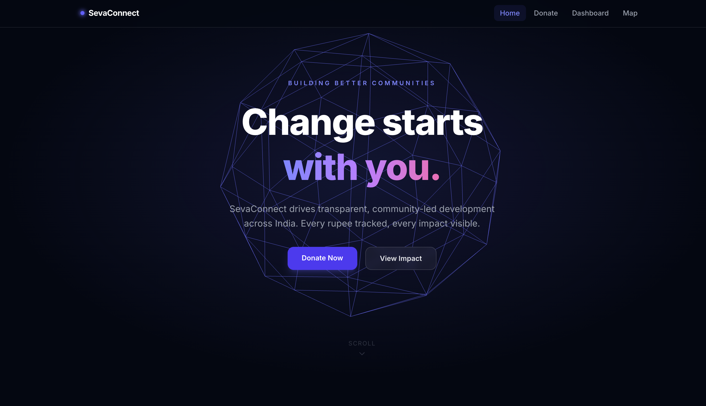
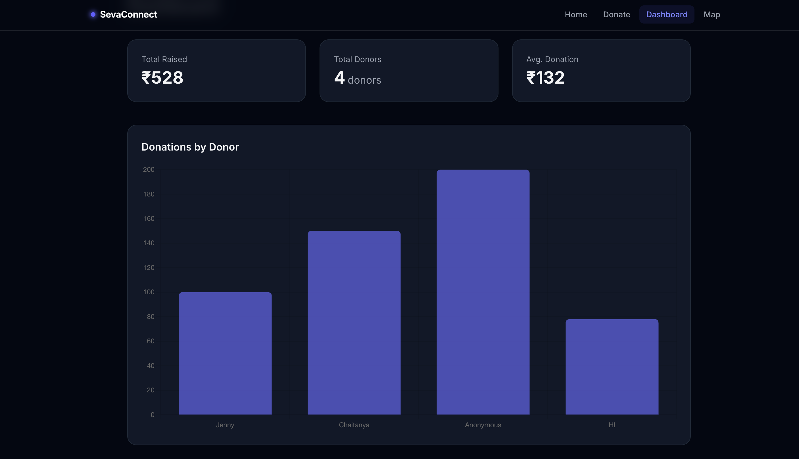
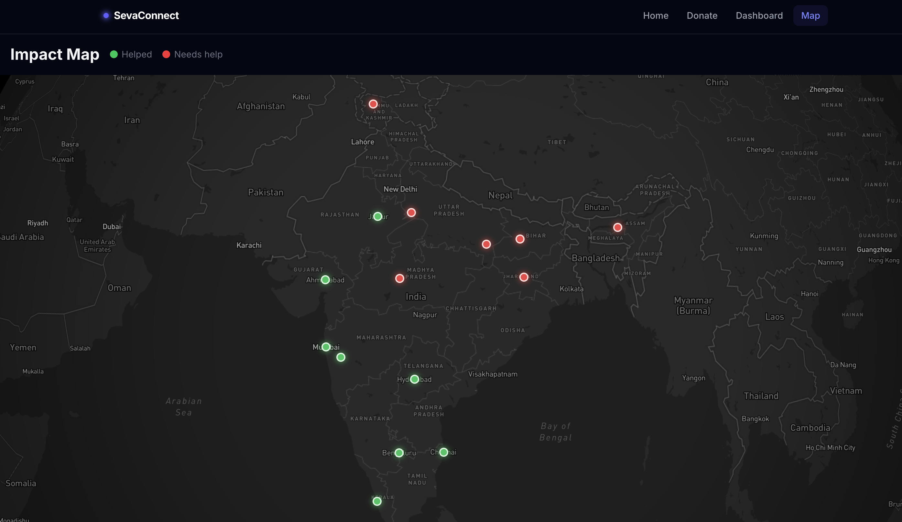
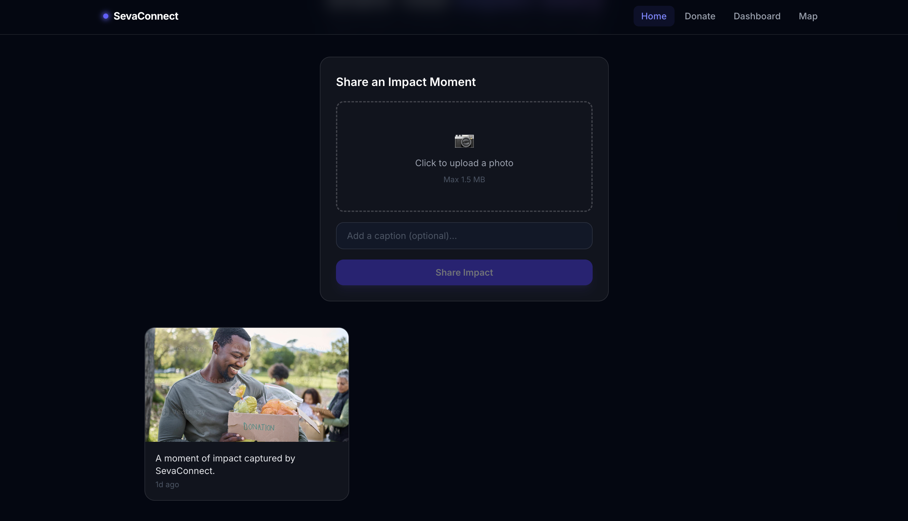
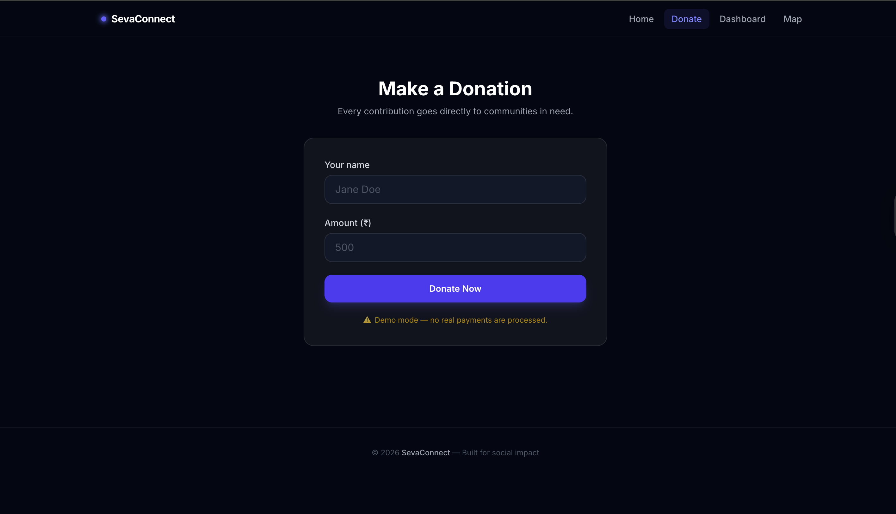

# SevaConnect

**A real-time NGO platform for transparent community development across India.**

Live: [ngoproject024.vercel.app](https://ngoproject024.vercel.app)

---

## Problem

Most NGOs lack the tools to show donors exactly where their money goes. Volunteers on the ground have no way to share field impact in real time, and aid allocation across regions is invisible to the public.

SevaConnect solves this by combining live impact tracking, transparent donation ledgers, and geospatial aid mapping into a single platform.

---

## Features

- **Real-Time Impact Feed** — volunteers upload photos and captions from the field; updates stream instantly via Firebase `onSnapshot` with no page refresh required
- **Image Upload & Captions** — field workers can attach a photo and write a caption; images are stored as base64 in Firestore and displayed in a live card grid
- **Donation System** — name-based donation form with inline success feedback and Firestore logging; Stripe integration is wired and ready for production keys (currently runs in demo mode)
- **Map-Based Aid Tracking** — Mapbox GL JS map visualises which cities have received aid (green) and which still need support (red), with hover tooltips and glow markers
- **Impact Dashboard** — live bar chart and stat cards showing total funds raised, donor count, and average donation, powered by Chart.js
- **Backend API Routes** — Next.js App Router API handlers for donations, impacts, and Stripe checkout sessions; all routes guard against missing environment variables at runtime
- **Environment-Based Configuration** — all secrets (Firebase, Mapbox, Stripe) are loaded from `.env.local`; the app degrades gracefully when keys are absent during build
- **Count-Up Stats** — scroll-triggered animated counters for funds raised, communities served, and volunteers deployed
- **3D Hero Background** — Three.js rotating icosahedron on the landing page
- **Mobile-Responsive** — fully responsive layout with hamburger nav and adaptive grids

---

## Tech Stack

| Layer | Technology |
|---|---|
| Framework | Next.js 16 (App Router) |
| Language | TypeScript |
| Styling | Tailwind CSS v4 |
| Database | Firebase Firestore |
| Auth | Firebase Authentication |
| Maps | Mapbox GL JS |
| Charts | Chart.js + react-chartjs-2 |
| 3D Graphics | Three.js |
| Payments | Stripe (demo mode) |
| Deployment | Vercel |

---

## Screenshots

| Homepage | Dashboard | Map |
|---|---|---|
|  |  |  |

| Impact Feed | Donate |
|---|---|
|  |  |

---

## Getting Started

### Prerequisites

- Node.js 18+
- A Firebase project with Firestore enabled
- A Mapbox account (free tier works)

### Installation

```bash
# 1. Clone the repository
git clone https://github.com/YOUR_USERNAME/YOUR_REPO.git
cd YOUR_REPO

# 2. Install dependencies
npm install

# 3. Set up environment variables
cp .env.example .env.local
# Fill in your keys (see Environment Variables below)

# 4. Run the development server
npm run dev
```

Open [http://localhost:3000](http://localhost:3000).

### Environment Variables

Create a `.env.local` file at the project root:

```env
NEXT_PUBLIC_FIREBASE_API_KEY=
NEXT_PUBLIC_FIREBASE_AUTH_DOMAIN=
NEXT_PUBLIC_FIREBASE_PROJECT_ID=
NEXT_PUBLIC_FIREBASE_STORAGE_BUCKET=
NEXT_PUBLIC_FIREBASE_MESSAGING_SENDER_ID=
NEXT_PUBLIC_FIREBASE_APP_ID=
NEXT_PUBLIC_MAPBOX_TOKEN=
STRIPE_SECRET_KEY=
STRIPE_WEBHOOK_SECRET=
NEXT_PUBLIC_BASE_URL=http://localhost:3000
```

---

## Deployment

The app is deployed on Vercel. To deploy your own instance:

1. Push the repo to GitHub
2. Import the project at [vercel.com](https://vercel.com)
3. Set the environment variables in **Project → Settings → Environment Variables**
4. Deploy

---

## Project Structure

```
src/
├── app/                  # Next.js App Router pages + API routes
│   ├── api/              # donations, impacts, payments
│   ├── dashboard/        # Impact dashboard
│   ├── donate/           # Donation page
│   └── map/              # Aid map page
├── components/
│   ├── animations/       # FadeIn, HeroScene (Three.js)
│   ├── dashboard/        # StatsCard
│   ├── impact/           # ImpactFeed, ImpactStats, ImageUploader, LiveBanner
│   ├── layout/           # Navbar, Footer
│   ├── map/              # MapView
│   └── payments/         # DonateForm
└── services/             # Firebase, Firestore helpers, Auth
```

---

## License

MIT
